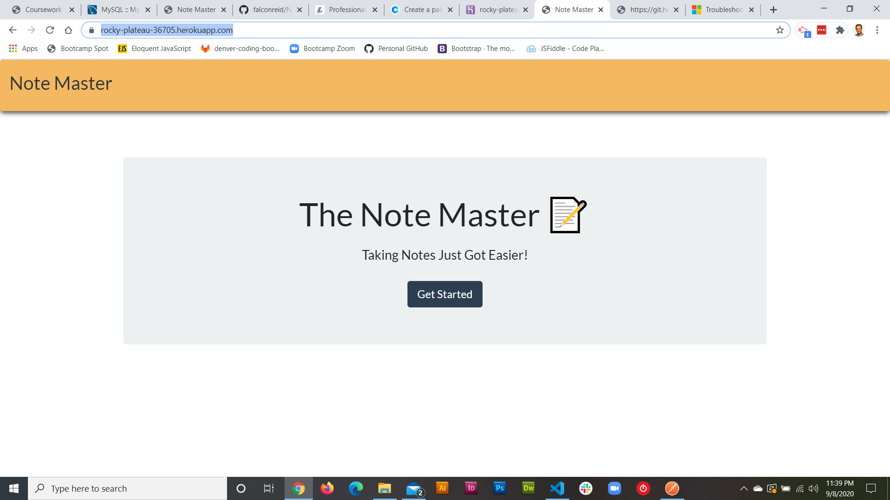
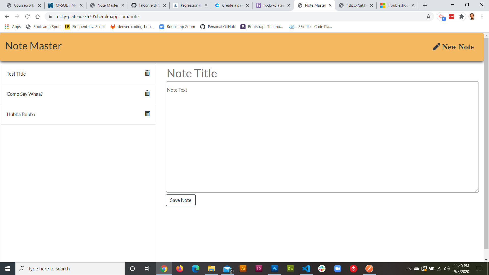

# The Note Master

Create and Save Notes With Ease

## Description

Created an application that can be used to write, save, and delete notes. This application uses an express backend and saves and retrieves note data from a JSON file.

## User Story

AS A user, I want to be able to write and save notes

I WANT to be able to delete notes I've written before

SO THAT I can organize my thoughts and keep track of tasks I need to complete

### Dependencies

Nodemon
Express
fs
path

run npm i in dedicated terminal
run node server.js or npm run dev-start

Github: [Click Here](https://github.com/falconreid/NoteMaster)
Heroku: [Click Here](https://rocky-plateau-36705.herokuapp.com/)
